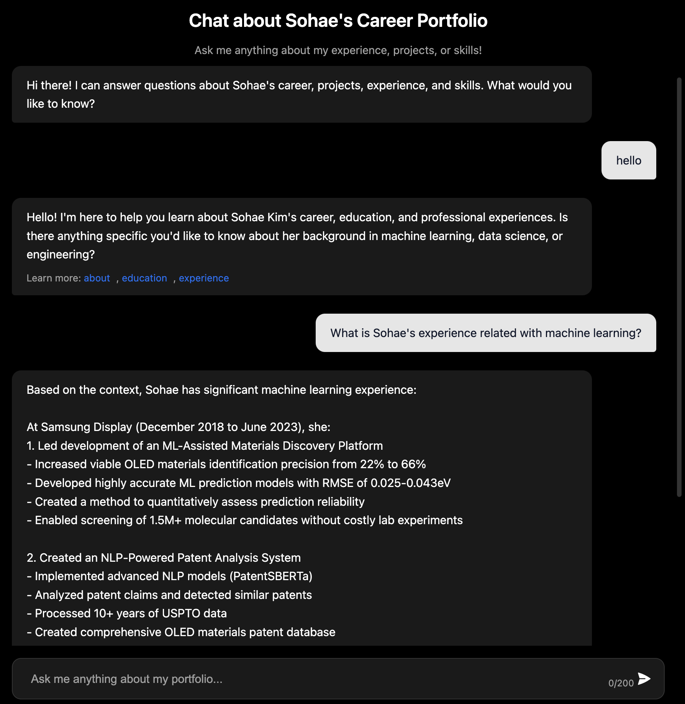

# RAG Chat - AI Assistant for My Portfolio

A Retrieval-Augmented Generation (RAG) chatbot that answers questions about my professional background and portfolio using Claude 3.5 Haiku.



## Features

- **AI-Powered Responses**: Uses Anthropic's Claude 3.5 Haiku to generate natural, informative responses
- **Context-Aware**: Retrieves relevant information from my portfolio content
- **Rate Limiting**: Prevents abuse with client and server-side rate limiting
- **Responsive Design**: Works on desktop and mobile devices
- **References**: Provides links to relevant sections of my portfolio
- **Analytics**: Tracks usage patterns with Vercel Analytics

## Technology Stack

- **Frontend**: HTML, CSS, JavaScript
- **Backend**: Python with FastAPI
- **AI**: Anthropic Claude 3.5 Haiku for text generation
- **Embeddings**: OpenAI's text-embedding-ada-002 for semantic search
- **Deployment**: Vercel Serverless Functions
- **Analytics**: Vercel Analytics

## How It Works

1. **Embedding Generation**: Content from my portfolio is converted into vector embeddings
2. **Query Processing**: User questions are converted to embeddings and matched with relevant content
3. **Context Building**: Matched content is used to create context for the AI
4. **Response Generation**: Claude generates a response based on the context and question
5. **Reference Linking**: Links to relevant portfolio sections are provided

## Local Development

### Prerequisites

- Python 3.9+
- Node.js (for frontend development)
- OpenAI API key
- Anthropic API key

### Setup

1. Clone the repository:
   ```bash
   git clone https://github.com/sohae-kim/rag-chat-resume.git
   cd rag-chat
   ```

2. Create a virtual environment:
   ```bash
   python -m venv venv
   source venv/bin/activate  # On Windows: venv\Scripts\activate
   ```

3. Install dependencies:
   ```bash
   pip install -r requirements.txt
   ```

4. Create a `.env` file with your API keys:
   ```
   OPENAI_API_KEY=your_openai_key
   ANTHROPIC_API_KEY=your_anthropic_key
   ```

5. Generate embeddings:
   ```bash
   python scripts/build.py
   ```

6. Run the development server:
   ```bash
   python run.py
   ```

7. Open http://localhost:8000 in your browser

## Deployment

This project is configured for deployment on Vercel as a serverless function:

1. Connect your GitHub repository to Vercel
2. Set environment variables in the Vercel dashboard:
   - `OPENAI_API_KEY`
   - `ANTHROPIC_API_KEY`
3. Deploy!

## Project Structure

```
rag-chat-resume/
├── api/                    # Vercel serverless functions
│   ├── index.py            # Main API endpoint
│   ├── chat.py             # Chat handler for AWS Lambda/Vercel
│   └── __init__.py         # Package initialization
├── app/                    # Backend application
│   ├── main.py             # FastAPI application
│   ├── utils.py            # Utility functions
│   ├── logging.py          # Logging configuration
│   └── __init__.py         # Package initialization
├── data/
│   ├── content.json        # Portfolio content
│   └── embeddings.json     # Generated embeddings (gitignored)
├── public/                 # Static files
│   ├── static/
│   │   ├── js/             # JavaScript files
│   │   ├── css/            # CSS files
│   │   └── images/         # Images
│   └── index.html          # Main HTML file
├── scripts/
│   ├── build.py            # Script to generate embeddings
│   └── generate_embeddings.py # Alternative embeddings generator
├── .env                    # Environment variables (gitignored)
├── .gitignore              # Git ignore file
├── next.config.js          # Next.js configuration for Vercel
├── package.json            # Node.js package configuration
├── requirements.txt        # Python dependencies
├── vercel.json             # Vercel configuration
└── README.md               # This file
```

## License

MIT

## Acknowledgements

- [Anthropic Claude](https://www.anthropic.com/claude) for the AI model
- [OpenAI Embeddings](https://platform.openai.com/docs/guides/embeddings) for semantic search
- [FastAPI](https://fastapi.tiangolo.com/) for the backend framework
- [Vercel](https://vercel.com/) for hosting 